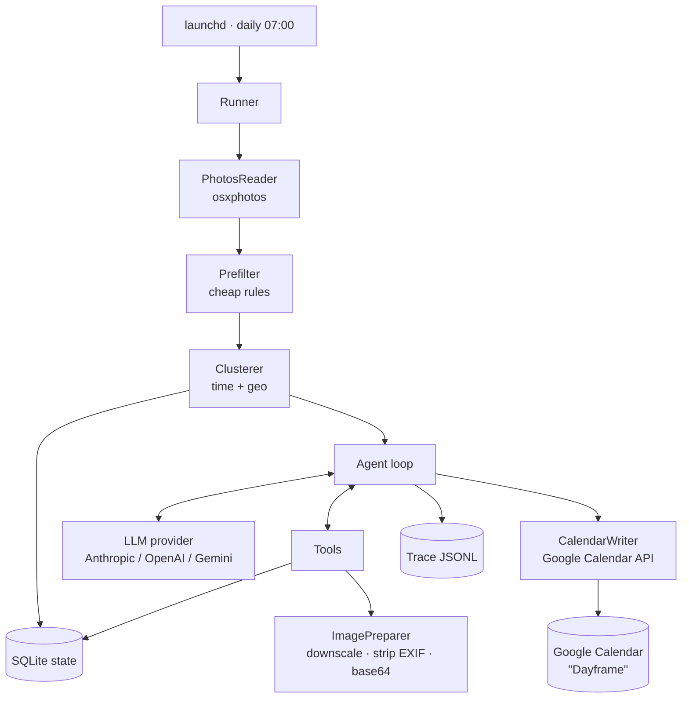
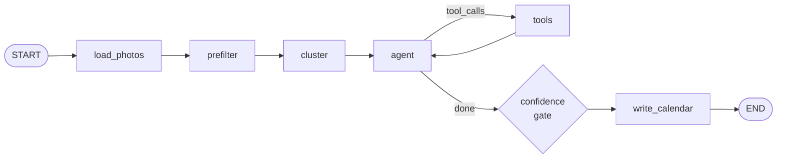

# Dayframe

**AI memories from your photos.**

Dayframe is a local macOS agent that reads photos added to your Apple Photos library in the last 24 hours, figures out which ones represent a real experience, and writes a short human memory into a dedicated calendar.

```
Sunset at the beach
Spent the afternoon swimming with the family, followed by ice cream
and sunset at Palmachim Beach.
```

One entry per experience. Not per photo. No gallery, no journaling prompt, no iOS app.

---

## Table of contents

- [Why this exists](#why-this-exists)
- [What you'll learn](#what-youll-learn-agentic-concepts)
- [Architecture](#architecture)
- [Components](#components)
- [The agent loop](#the-agent-loop)
- [The graph (LangGraph)](#the-graph-langgraph)
- [Tool surface](#tool-surface)
- [Data model](#data-model)
- [Configuration](#configuration)
- [CLI](#cli)
- [Permissions](#permissions-the-annoying-part)
- [Google Calendar credentials (M4)](#google-calendar-credentials-m4)
- [Milestones](#milestones)
- [Evaluation](#evaluation)
- [Non-goals](#non-goals)
- [Decisions](#decisions)

---

## Why this exists

Two goals, and they're weighted differently.

1. **Product goal:** turn a photo library into a passive, searchable timeline of lived experiences.
2. **Learning goal (primary):** build a small, honest agentic system end to end — tools, loop, context budget, guardrails, state, traces, evals — on a task that's genuinely ambiguous enough to need judgment, but small enough to finish.

**Honesty up front:** this task does not *require* an agent. A single vision call with a good prompt would produce decent memories. That's exactly why it's a good teaching project — you build the pipeline version first (M2), then the agent version (M3), and you measure whether the agency actually bought you anything. Most real agent projects skip that comparison and never find out.

---

## What you'll learn (agentic concepts)

Each milestone introduces exactly one concept. Nothing is introduced before it's needed.

| Concept | Where it shows up |
|---|---|
| Deterministic vs. model work | Clustering is code; "is this meaningful?" is the model |
| Tool calling | `list_clusters`, `view_photos`, `write_memory`, `discard_cluster` |
| The agent cycle | `agent/graph.py` — request → tool_use → execute → tool_result → repeat |
| Context engineering | Model sees cheap text metadata first, requests pixels only when needed |
| Progressive disclosure | `expand_cluster` lets the model pull more photos into its own context |
| Structured output | Memories arrive as tool arguments against a JSON schema, never parsed from prose |
| Budgets & guardrails | Max turns, max images, max cost, wall-clock timeout |
| Idempotency | SQLite ledger of processed assets; re-running a day is a no-op |
| Human in the loop | `--dry-run` and an optional approval gate before anything touches your calendar |
| Observability | Every turn appended to a JSONL trace; `dayframe replay` reconstructs a run |
| Evals | A fixture set of days with expected keep/skip labels and a scored harness |
| Provider abstraction | The loop is provider-agnostic; only wire format differs |

---

## Architecture



**The flow in one sentence:** read yesterday's assets → drop the obviously worthless ones with rules → group the rest into candidate sessions with math → hand the agent a cheap text summary of those sessions and let it decide what to look at, what's meaningful, and what to write → write approved memories to the calendar and record everything.

### Why the split

Clustering by timestamp and GPS is a solved problem with a closed-form answer. Sending it to an LLM would be slow, expensive, non-deterministic, and worse. **Do it in code.**

Deciding whether "eleven photos at a restaurant at 20:30" is a birthday dinner worth remembering or a work meeting you photographed a whiteboard at — that has no closed form. **That's the model's job.**

Learning where that line sits is most of what agent engineering actually is.

---

## Components

### `dayframe/photos/` — Photos library reader

Wraps [`osxphotos`](https://github.com/RhetTbull/osxphotos). Do **not** query `Photos.sqlite` directly — the schema is private and changes between macOS releases. osxphotos absorbs that pain.

What you get per asset, for free, with zero model calls:

| Field | Use |
|---|---|
| `uuid` | Idempotency key |
| `date`, `date_added` | Clustering + the 24h window |
| `latitude`, `longitude` | Geo clustering |
| `place.name` | Apple already reverse-geocoded it. Free place names. |
| `screenshot`, `uti` | Prefilter |
| `burst`, `burst_photos` | Duplicate collapsing |
| `persons`, `face_info` | Strong "meaningful" signal |
| `score.overall`, `score.wellTimed` | Photos' own aesthetic ML — use it to pick representatives |
| `path`, `path_edited` | Feeding the ImagePreparer |

Interface:

```python
class PhotosReader(Protocol):
    def assets_added_between(self, start: datetime, end: datetime) -> list[Asset]: ...
    def asset(self, uuid: str) -> Asset: ...
```

Keep it a Protocol so tests run off a JSON fixture instead of a real library.

### `dayframe/prefilter/` — cheap rule-based rejection

Runs before the model. **Be conservative** — a rule that wrongly drops a real memory is invisible and unrecoverable; a junk photo that reaches the model just costs a fraction of a cent.

Rules for v1:

- `screenshot == True` → drop
- UTI is PDF / PNG-with-no-EXIF-camera → drop
- Already in `assets_seen` → drop (idempotency)
- Burst sets → collapse to the single highest `score.overall`

Everything else survives to clustering. Resist the urge to add "no GPS → drop" or "fewer than 3 photos → drop". You'll lose real moments.

### `dayframe/cluster/` — session clustering

Sort surviving assets by capture time, then start a new cluster when either holds:

```
time_gap  > 90 min
haversine > 1.5 km  AND  time_gap > 20 min
```

Tunable in config. Output:

```python
@dataclass
class Cluster:
    id: str                  # "2026-09-17-004"
    assets: list[Asset]
    start: datetime
    end: datetime
    place: str | None        # modal place.name across assets
    centroid: tuple[float, float] | None
    people: list[str]        # union of named persons
```

### `dayframe/agent/` — the loop, the tools, the prompts

Covered in detail below. Prompts live in `prompts/system_v1.md` as versioned files, not string literals. You will iterate on them constantly and you want `git diff` to show it.

### `dayframe/models.py` — model construction

With LangGraph you get LangChain's provider layer, so this file is thin by design:

```python
model = init_chat_model(cfg.provider.model, temperature=0.3).bind_tools(TOOLS)
```

Model strings are `"anthropic:claude-sonnet-4-5"`, `"openai:gpt-..."`, etc. Keep the string in config, never in code — M6 routes between a cheap and a strong model and you don't want that hardcoded.

### `dayframe/images/` — ImagePreparer

Before anything leaves the machine:

- Downscale to 1024px long edge (vision models gain little above this and cost scales with pixels)
- Re-encode JPEG q80
- Strip all EXIF
- Optionally drop GPS from the *text* context too, sending only `place.name` (`privacy.send_coordinates = false`)

### `dayframe/calendar/` — CalendarWriter (Google Calendar API)

Writes to a **secondary calendar named `Dayframe`**, created by Dayframe on first run. It never writes to your primary calendar.

**Auth.** OAuth 2.0 desktop flow via `google-auth-oauthlib`. One-time interactive consent (`dayframe auth`), refresh token cached at `~/Dayframe/google_token.json` (mode `0600`). After that it runs unattended.

Request the narrowest scope that works:

```
https://www.googleapis.com/auth/calendar.app.created
```

This grants access **only to calendars the app itself created** — Dayframe literally cannot read or modify your existing calendars. It covers `calendars().insert()` and event writes on that calendar. It does **not** cover `calendarList().list()`, so Dayframe looks up a stored `calendar_id` (or creates the calendar) instead of listing yours. If `calendars().insert()` later 403s on that scope, fall back to `calendar.events` plus a manually created calendar whose ID you paste into config.

**Deterministic event IDs — free idempotency.** Google lets you supply the event ID on insert. Valid IDs are base32hex (`0-9`, `a-v`), so a SHA-1 hex digest is directly usable:

```python
event_id = hashlib.sha1(f"dayframe:{cluster_id}".encode()).hexdigest()
```

Re-inserting the same memory returns **409 Conflict** instead of creating a duplicate. Treat 409 as success. That single line removes an entire class of "the daily job ran twice" bug.

**Event body:**

```json
{
  "id": "3f2a1c...",
  "summary": "Dayframe: Sunset at Palmachim Beach",
  "description": "Spent the afternoon swimming with the family, followed by ice cream and sunset at Palmachim Beach.",
  "location": "Palmachim Beach",
  "start": { "dateTime": "2026-09-17T16:12:00+03:00", "timeZone": "Asia/Jerusalem" },
  "end":   { "dateTime": "2026-09-17T19:40:00+03:00", "timeZone": "Asia/Jerusalem" },
  "transparency": "transparent",
  "extendedProperties": {
    "private": {
      "dayframe_run_id": "run_2026-09-18T07:00",
      "dayframe_cluster_id": "2026-09-17-004",
      "dayframe_confidence": "0.86"
    }
  }
}
```

`transparency: transparent` keeps memories from marking you busy. `extendedProperties.private` is the undo mechanism — `dayframe undo <run_id>` lists events with `privateExtendedProperty=dayframe_run_id=<id>` and deletes them, no local ID bookkeeping required.

**Always send an explicit IANA `timeZone`.** Photos gives you naive local timestamps; Google will guess wrong if you let it.

**This boundary is now a network call.** Unlike EventKit, it can fail halfway. Wrap inserts in retry-with-backoff, and write each successful event to `memories` *before* moving on so a mid-run failure resumes cleanly rather than restarting.

**Fallback:** `.ics` written to `~/Dayframe/out/` when auth is unavailable. Keeps the pipeline testable offline and in CI.

### `dayframe/store/` — SQLite state

Single file at `~/Dayframe/dayframe.db`. See [Data model](#data-model).

---

## The agent loop

Before the code, the mechanism — because LangGraph will hide it and you should know what it's hiding.

A **turn** is one round trip. The model receives the system prompt, the full message history, and the tool schemas. It replies with either text (it's done) or one or more tool calls. You execute those calls, append the results to the message history as a new message, and send everything again. Nothing persists on the model's side; the growing message list *is* the agent's memory.

```
turn 1   [digest]                        → wants expand_cluster(c004)
turn 2   [digest, calls, results]        → wants view_photos(c004)
turn 3   [digest, calls, results, ...]   → wants write_memory(c004) + discard(c001..c003)
turn 4   [... everything ...]            → text: done
```

Three things that are your job, not the framework's:

- **Termination** — stop when the model returns no tool calls, or when a turn cap is hit. Runaway loops are the default failure mode.
- **Budget** — images, tokens, cost, wall-clock. Charged per turn, enforced inside tools.
- **Trace** — every turn appended to JSONL. Without it you cannot debug a non-deterministic system.

LangGraph gives you the accumulation and the cycle. The three above stay yours.


### What the agent actually sees first

Not images. A compact text digest — this is the context-engineering lesson:

```
Yesterday: 2026-09-17. 47 photos across 6 candidate sessions.

[c001] 07:42–07:55 · 3 photos · home · no people
[c002] 09:10–09:14 · 2 photos · Azrieli Center, Tel Aviv · no people
[c003] 12:30–12:33 · 1 photo  · unknown · no people
[c004] 16:12–19:40 · 24 photos · Palmachim Beach · Maya, Noa
[c005] 20:15–20:22 · 5 photos · unknown · no people
[c006] 22:40–22:41 · 2 photos · home · no people
```

Roughly 200 tokens. From this alone the model can already tell that `c004` deserves a look and `c003` almost certainly doesn't. It spends its image budget where it matters — and it decides that, not you.

This is the core of the exercise: **an agent that chooses what enters its own context is doing something a pipeline cannot.**

---

## The graph (LangGraph)

LangGraph stays simple here as long as you use a narrow slice of it. The trap is `create_react_agent` — one line, works immediately, and hides everything above. Build the graph by hand instead. It's about 25 lines.



Deterministic work is plain Python nodes. The agent and tools form the only cycle. That's the same shape as the hand-rolled loop — LangGraph just manages the state threading.

### State

```python
class DayframeState(TypedDict):
    run_id:       str
    target_date:  str
    clusters:     list[Cluster]
    messages:     Annotated[list[AnyMessage], add_messages]
    memories:     list[Memory]
    discarded:    list[dict]
    images_sent:  int
    cost_usd:     float
```

`add_messages` is the one piece of LangGraph magic worth accepting — it's the accumulator you'd otherwise write yourself.

### The graph

```python
g = StateGraph(DayframeState)
g.add_node("load_photos", load_photos)
g.add_node("prefilter", prefilter)
g.add_node("cluster", cluster)
g.add_node("agent", agent_node)
g.add_node("tools", ToolNode(TOOLS))
g.add_node("write_calendar", write_calendar)

g.add_edge(START, "load_photos")
g.add_edge("load_photos", "prefilter")
g.add_edge("prefilter", "cluster")
g.add_edge("cluster", "agent")
g.add_conditional_edges("agent", tools_condition,
                        {"tools": "tools", END: "write_calendar"})
g.add_edge("tools", "agent")
g.add_edge("write_calendar", END)

graph = g.compile(
    checkpointer=SqliteSaver.from_conn_string("~/Dayframe/dayframe.db"),
    interrupt_before=["write_calendar"] if cfg.approval_mode == "review" else [],
)
```

### The agent node

```python
model = init_chat_model(cfg.provider.model).bind_tools(TOOLS)

def agent_node(state: DayframeState) -> dict:
    if state["images_sent"] >= cfg.max_images:
        return {"messages": [SystemMessage(BUDGET_EXHAUSTED)]}

    msg = model.invoke([SystemMessage(load_prompt("system_v1"))] + state["messages"])
    trace.append(state["run_id"], msg)
    return {
        "messages": [msg],
        "cost_usd": cost_of(msg.usage_metadata),
    }
```

That's the whole loop body. `add_messages` appends; `tools_condition` decides whether to go round again.

### What LangGraph actually buys you

| Feature | Value here |
|---|---|
| `SqliteSaver` checkpointer | Crash mid-run resumes from the last node instead of re-sending images. Real money saved. |
| `interrupt_before=["write_calendar"]` | `approval_mode = "review"` becomes one line instead of a control-flow rewrite. |
| `graph.stream(stream_mode="updates")` | Per-node events feed your JSONL trace for free. |
| `tools_condition` / `ToolNode` | Standard tool dispatch, less boilerplate than a hand-written switch. |

The interrupt is the strongest argument. Human-in-the-loop on a durable, resumable graph is a genuinely hard thing to build yourself, and it's a first-class agentic concept.

### What it costs

- **The loop stops being visible.** The cycle you most want to understand becomes `add_conditional_edges`.
- **Provider layer moves to LangChain.** `init_chat_model(...)` replaces any client of your own. Convenient, but the wire format is invisible by default — hence the exercise below.
- **API churn.** LangGraph moves fast; expect to fix imports when you return after a gap.
- **Debugging through layers.** A malformed tool schema surfaces several frames from where you wrote it.

### Exercise: see what's actually on the wire

Since you're starting at the framework layer, spend twenty minutes deliberately looking underneath it once. Attach a callback that dumps what LangChain sends and receives:

```python
class RawDump(BaseCallbackHandler):
    def on_chat_model_start(self, serialized, messages, **kw):
        Path("raw_request.json").write_text(
            json.dumps([m.dict() for m in messages[0]], indent=2, default=str))

graph.invoke(state, config={"callbacks": [RawDump()], "recursion_limit": 30})
```

Then read `raw_request.json` and, from a response, `msg.tool_calls`, `msg.additional_kwargs`, `msg.response_metadata`, `msg.usage_metadata`.

What you're looking for: tool schemas are just JSON travelling in the request; a tool *call* is structured data in the assistant message; a tool *result* is an ordinary message with a `tool_call_id` pointing back. There is no magic and no server-side session — the entire agent is a growing list of messages resent every turn. Once you've seen that, the rest of LangGraph reads as convenience rather than mystery.

(Callback APIs drift between versions. If the signature above doesn't match, the current handler docs will have the equivalent — the thing you want is the messages passed at chat-model start.)

### Two gotchas

**`recursion_limit` counts super-steps, not turns.** One agent turn is two steps (agent + tools), so cap it at roughly `2 * max_turns + 6`. Set it wrong and you'll get `GraphRecursionError` on a normal busy day.

**Budgets live in the tools, not the graph.** `ToolNode` just executes. Enforce the image budget inside `view_photos` — when exhausted, return a normal tool result saying so rather than raising. The model then adapts instead of crashing the run, which is the behaviour you want.


Four tools. Keep it that way.

### `view_photos`

```json
{
  "name": "view_photos",
  "description": "Attach up to 4 representative photos from a cluster to the conversation for visual inspection. Costs image budget. Call this only for clusters that plausibly represent a real experience.",
  "input_schema": {
    "type": "object",
    "properties": {
      "cluster_id": { "type": "string" },
      "count":      { "type": "integer", "minimum": 1, "maximum": 4, "default": 3 }
    },
    "required": ["cluster_id"]
  }
}
```

Representatives are picked in code by `score.overall`, spread across the cluster's time range so you don't get four near-identical frames.

### `expand_cluster`

Returns more text metadata for a cluster (per-photo timestamps, filenames, face counts, exact places) without spending image budget. The cheap way for the agent to resolve uncertainty. Teaches that not every "I need more info" needs to be expensive.

### `write_memory`

```json
{
  "name": "write_memory",
  "input_schema": {
    "type": "object",
    "properties": {
      "cluster_id": { "type": "string" },
      "title":      { "type": "string", "maxLength": 70 },
      "body":       { "type": "string", "maxLength": 300 },
      "category":   { "type": "string",
                      "enum": ["trip","family","meal","celebration",
                               "outing","hobby","nature","other"] },
      "confidence": { "type": "number", "minimum": 0, "maximum": 1 }
    },
    "required": ["cluster_id","title","body","category","confidence"]
  }
}
```

The schema *is* the output contract. No regex over prose, ever.

### `discard_cluster`

```json
{ "cluster_id": "string", "reason": "string" }
```

Forcing a stated reason costs almost nothing and gives you a labelled dataset for free. Every discard reason is a future eval case and a future prompt fix. This single design choice will teach you more than the rest of the tool surface combined.

### Prompt skeleton (`prompts/system_v1.md`)

```
You are Dayframe. You review one day of a person's photos and record
only the experiences worth remembering.

An experience is worth remembering if a person would plausibly want to
find it again in a year: trips, meals with others, celebrations, outings,
time in nature, hobbies, milestones.

It is not worth remembering if it is functional: screenshots, documents,
receipts, parking spots, whiteboards, product photos, or a single
context-free image.

Process:
1. Read the session digest.
2. Use expand_cluster for cheap clarification.
3. Use view_photos only where visual context would change your decision.
4. Call write_memory or discard_cluster exactly once per cluster.

Write memories in the person's voice. Concrete, warm, under three
sentences. Never invent details you cannot see.
Never mention photos, images, or analysis.

Titles must name the place when one is known: "Sunset at Palmachim
Beach", not "Sunset at the beach". Without a known place, name the
activity: "Birthday dinner with friends". Keep titles under 70
characters and write everything in English.

Confidence is your honest estimate that this is a real, memorable
experience. Be strict — anything below 0.7 will be discarded, and a
wrong memory in someone's calendar is worse than a missing one.
```

---

## Data model

```sql
CREATE TABLE runs (
  id            TEXT PRIMARY KEY,   -- "run_2026-09-18T07:00"
  target_date   TEXT NOT NULL,
  started_at    TEXT NOT NULL,
  finished_at   TEXT,
  status        TEXT NOT NULL,      -- running|ok|failed|budget_exceeded
  turns         INTEGER,
  images_sent   INTEGER,
  input_tokens  INTEGER,
  output_tokens INTEGER,
  cost_usd      REAL,
  provider      TEXT,
  model         TEXT,
  prompt_version TEXT
);

CREATE TABLE assets_seen (
  uuid      TEXT PRIMARY KEY,
  added_at  TEXT NOT NULL,
  run_id    TEXT NOT NULL REFERENCES runs(id)
);

CREATE TABLE clusters (
  id         TEXT PRIMARY KEY,
  run_id     TEXT NOT NULL REFERENCES runs(id),
  start_ts   TEXT NOT NULL,
  end_ts     TEXT NOT NULL,
  place      TEXT,
  lat        REAL,
  lon        REAL,
  asset_count INTEGER NOT NULL,
  decision   TEXT,                  -- kept|discarded|unreviewed
  reason     TEXT
);

CREATE TABLE memories (
  id           TEXT PRIMARY KEY,
  cluster_id   TEXT NOT NULL REFERENCES clusters(id),
  title        TEXT NOT NULL,
  body         TEXT NOT NULL,
  category     TEXT NOT NULL,
  confidence   REAL NOT NULL,
  event_id     TEXT,                -- EventKit identifier, for undo
  created_at   TEXT NOT NULL
);
```

Traces go to `~/Dayframe/traces/<run_id>.jsonl` — one JSON object per turn, containing the request messages, the raw completion, tool calls, tool results, and usage. Big, ugly, and the single most useful thing you'll build when the agent misbehaves.

---

## Configuration

`~/Dayframe/config.toml`

```toml
[provider]
name   = "anthropic"
model  = "claude-sonnet-4-5"
# API key from DAYFRAME_API_KEY env var. Never in this file.

[window]
mode     = "previous_calendar_day"   # [yesterday 00:00, today 00:00) local
basis    = "date_added"              # not capture time — see Decisions #1
run_at   = "07:00"

[cluster]
time_gap_minutes = 90
geo_gap_km       = 1.5
min_gap_for_geo_split_minutes = 20

[budget]
max_turns      = 12
max_images     = 16
max_cost_usd   = 0.25
timeout_seconds = 180

[privacy]
send_coordinates = false   # send place names only
strip_exif       = true
max_image_px     = 1024

[calendar]
provider       = "google"
name           = "Dayframe"      # secondary calendar, created on first run
calendar_id    = ""              # filled in automatically after creation
timezone       = "Asia/Jerusalem"
approval_mode  = "auto"          # auto | review
min_confidence = 0.7             # below this: logged locally, never written
title_prefix   = "Dayframe: "    # set "" to drop it once the calendar is colour-coded
language       = "en"
# OAuth client secret path from DAYFRAME_GOOGLE_CLIENT_SECRET env var.
# Token cached at ~/Dayframe/google_token.json — gitignore it.
```

---

## CLI

```bash
dayframe auth                          # one-time Google OAuth consent flow
dayframe doctor                        # check permissions, library, API key, calendar
dayframe run --date yesterday          # full run
dayframe run --date 2026-09-17 --dry-run
dayframe run --date yesterday --no-calendar   # everything but the write

dayframe photos list --since 24h       # what the reader sees
dayframe clusters show <run_id>         # what the clusterer produced
dayframe replay <run_id>               # human-readable trace walkthrough
dayframe undo <run_id>                 # delete that run's calendar events

dayframe eval run                      # score against fixtures
dayframe install-agent                 # write the launchd plist
```

`--dry-run` prints proposed memories and the cost, and writes nothing. It should be the first flag you implement and the one you use for the first two weeks.

---

## Permissions (the annoying part)

Budget real time for this. It's the most common place this kind of project dies.

1. **Full Disk Access** — required to read the Photos library. Granted to the *executable*, not the project. For development that's Terminal.app or iTerm. For the launchd agent it's whatever binary launchd invokes, which is often a different Python than the one in your shell.
2. **Google Calendar OAuth** — no macOS TCC involvement at all, which is the main reason Google is easier here. Follow [Google Calendar credentials (M4)](#google-calendar-credentials-m4): Cloud project, Calendar API, OAuth **Desktop app** client JSON, then `dayframe auth` once interactively.
3. **launchd** — `~/Library/LaunchAgents/com.dayframe.daily.plist` with `StartCalendarInterval`. Use `RunAtLoad = false` and always redirect stdout/stderr to a log file; a silently failing launchd job is indistinguishable from a working one.

`dayframe doctor` should check all three and print an exact remediation step for each failure. Write it early — you'll run it a hundred times.

---

## Google Calendar credentials (M4)

Dayframe does **not** use a Google Cloud API key. Calendar writes need a signed-in user, so auth is **OAuth 2.0 for a Desktop app**. What you download is a client JSON (`client_id` + `client_secret`). `dayframe auth` then opens a browser, you consent, and a refresh token is cached at `~/Dayframe/google_token.json`. After that the daily job runs unattended.

If you create a key on **APIs & Services → Credentials → API keys**, it will not work. Ignore that page.

### 1. Create a Cloud project

1. Open [Google Cloud Console](https://console.cloud.google.com/) signed in as the Google account whose calendar you want.
2. Project picker (top bar) → **New project**.
3. Name it `Dayframe`. Create it, then select it.

### 2. Enable the Calendar API

1. [Enable Google Calendar API](https://console.cloud.google.com/apis/library/calendar-json.googleapis.com) for that project.
2. Confirm it says **API enabled**.

### 3. Configure the OAuth consent screen

Google Auth Platform has to exist before you can create a client.

1. Open [Google Auth Platform → Branding](https://console.cloud.google.com/auth/branding). If it says not configured, click **Get started**.
2. **App name:** `Dayframe`
3. **User support email / developer contact:** your Gmail.
4. **Audience:** **External** (unless this is a Google Workspace org-internal app).
5. Accept the User Data Policy and create.

Then:

1. [Audience](https://console.cloud.google.com/auth/audience) → **Add users** → add the same Gmail. While the app is in **Testing**, only listed test users can consent.
2. [Data Access](https://console.cloud.google.com/auth/scopes) → **Add or remove scopes**. Under *Manually add scopes*, paste:

```
https://www.googleapis.com/auth/calendar.app.created
```

That scope only covers calendars **this app created**. Dayframe cannot read or change your primary calendar. If `calendars().insert()` later 403s on that scope, fall back to `https://www.googleapis.com/auth/calendar.events` and paste a manually created calendar ID into `config.toml` (`[calendar].calendar_id`).

Do **not** request `calendar` (full access) or `calendar.readonly`.

### 4. Create a Desktop OAuth client

1. Open [Google Auth Platform → Clients](https://console.cloud.google.com/auth/clients) → **Create client**.
2. **Application type:** **Desktop app** (not Web, not iOS, not API key).
3. **Name:** `Dayframe local`
4. **Create**. Download the JSON **immediately** — Google only shows the client secret at creation time.

The file looks like this (`installed` is the desktop-app marker):

```json
{
  "installed": {
    "client_id": "….apps.googleusercontent.com",
    "project_id": "dayframe-…",
    "client_secret": "GOCSPX-…",
    "auth_uri": "https://accounts.google.com/o/oauth2/auth",
    "token_uri": "https://oauth2.googleapis.com/token",
    "redirect_uris": ["http://localhost"]
  }
}
```

Store it **outside the repo**, e.g. `~/Dayframe/google_client_secret.json`, mode `0600`. Never commit it. Never put it in `config.toml`.

### 5. Point Dayframe at the JSON

In the project `.env` (or `~/Dayframe/.env`):

```bash
DAYFRAME_GOOGLE_CLIENT_SECRET=/Users/you/Dayframe/google_client_secret.json
```

Then:

```bash
dayframe doctor    # google_calendar should complain only about the missing token
dayframe auth      # browser consent; writes ~/Dayframe/google_token.json (0600)
dayframe doctor    # google_calendar PASS
```

Consent as the same account you added as a test user. Google will show an **unverified app** warning — **Advanced → Go to Dayframe (unsafe)** is expected for a personal single-user app.

If the page says **400 … request because it is malformed**:

1. Ctrl+C `dayframe auth` and run it again after pulling the latest `dayframe/calendar/auth.py` (redirect is `127.0.0.1`, not `localhost`).
2. Open the URL in **Chrome or Safari**, not Cursor's Simple Browser. Do not click the terminal hyperlink — `&` truncates it. Copy the whole URL.
3. Confirm [Data Access](https://console.cloud.google.com/auth/scopes) includes `https://www.googleapis.com/auth/calendar.app.created` and [Audience](https://console.cloud.google.com/auth/audience) lists your Gmail as a test user.
4. Try an incognito window (extensions can 400 Google's accounts page).

### 6. Publish before launchd (or tokens die on day 8)

While publishing status is **Testing**, Google expires refresh tokens after **7 days**. The daily job will look fine for a week, then fail silently.

Before `dayframe install-agent`: [Audience](https://console.cloud.google.com/auth/audience) → **Publish app** / **In production**. You will still see the unverified-app warning on consent; that is fine for your own account. Skip Google's verification process — you are not distributing this.

If auth later fails with `invalid_grant`, delete `~/Dayframe/google_token.json` and run `dayframe auth` again.

### Checklist

| Piece | Where it lives |
|---|---|
| Calendar API enabled | Cloud project |
| OAuth **Desktop** client JSON | `DAYFRAME_GOOGLE_CLIENT_SECRET` |
| Refresh token | `~/Dayframe/google_token.json` (created by `dayframe auth`) |
| Secondary calendar name | `config.toml` `[calendar].name` = `"Dayframe"` |
| Calendar ID | filled in on first successful write |

**Done when:** `dayframe doctor` reports `google_calendar` PASS, and a test event shows up on your phone under a calendar named Dayframe — not on your primary calendar.

---

## Milestones

Each one is shippable and teaches one thing. Don't skip ahead.

### M0 — Walking skeleton (½ day)
Repo, package layout, `config.toml` loader, SQLite schema, `dayframe doctor` stub, CI running `ruff` + `pytest`.
**Done when:** `dayframe doctor` prints a checklist, all red.

### M1 — Photos → clusters, no AI (1–2 days)
osxphotos reader, prefilter, clusterer, `dayframe photos list` and `dayframe clusters show`.
**Done when:** you run it on a real day and the clusters match how you'd describe that day out loud.
**Concept:** doing deterministic work deterministically.

### M2 — Baseline: one vision call (1 day)
No agent. Send the digest plus up to 8 images in a single call, parse structured output, print memories. Record cost and wall time.
**Done when:** `dayframe run --dry-run` prints plausible memories.
**Concept:** structured output, and a baseline you can be beaten by.

### M3 — The agent graph (3 days) ← *the point of the project*
LangGraph `StateGraph`, `agent ⇄ ToolNode` cycle, the four tools, budgets enforced inside tools, `SqliteSaver` checkpointer, JSONL traces. Do the wire-format exercise on day one.
**Done when:** a run on a 50-photo day uses fewer images than M2 and produces equal or better memories — with the trace to prove it — and killing the process mid-run then re-running resumes instead of restarting.
**Concept:** tool calling, the agent cycle, context budgeting, progressive disclosure, checkpointed state.

### M4 — Calendar write (1 day)
First: [get Google Calendar credentials](#google-calendar-credentials-m4). Then: `dayframe auth`, Google Calendar client, secondary-calendar creation, deterministic event IDs, retry/backoff, `.ics` fallback, `dayframe undo`.
**Done when:** yesterday appears in Google Calendar on your phone, running the same day **twice** produces no duplicates, and `undo` removes the run completely.
**Concept:** side effects across a network boundary — idempotency, reversibility, partial-failure recovery.

### M5 — Autonomy (1 day)
launchd plist, `install-agent`, run ledger, failure logging, `review` approval mode.
**Done when:** it runs for a week untouched and you find memories you forgot were being written.
**Concept:** unattended operation, human-in-the-loop as a config option.

### M6 — Evals and model routing (2 days)
10–15 fixture days with hand-labelled keep/skip. Scoring harness.

Provider swapping is now a config string (`init_chat_model("openai:...")`), so it teaches nothing — do something with actual leverage instead: **route by cost**. A cheap fast model triages the digest and shortlists candidate clusters; the strong model only sees the shortlist and writes the memories. Two nodes, one conditional edge.
**Done when:** `dayframe eval run` prints precision/recall, changing the prompt moves the number, and routing cuts cost per day without hurting either metric.
**Concept:** evaluating non-deterministic systems; spending model capability where it pays.

---

## Evaluation

Fixtures live in `tests/fixtures/days/<name>.json` — serialized asset metadata plus local image paths, so tests need neither a Photos library nor a network.

Labels per cluster: `keep` / `skip`, plus a one-line description of the expected memory.

Metrics:

- **Skip precision** — of clusters the agent kept, how many should have been kept. (A junk memory in your calendar is the loud failure.)
- **Keep recall** — of clusters that should have been kept, how many were. (The quiet failure — and the one that actually kills the product.)
- **Cost per day** — mean USD and images sent.
- **Memory quality** — judged, not scored. Read them. If a memory reads like a caption instead of something you'd write, the prompt is wrong.

Include adversarial fixtures: a day of only screenshots, a day with one great photo and nothing else, a work trip where photos are all whiteboards, a day with GPS entirely missing.

---

## Non-goals

- Any iOS or watchOS app
- A photo browser, gallery, or editor
- Local model inference
- Uploading the full library anywhere
- Multi-user, accounts, sync, or a server
- Backfilling years of history (v2 at the earliest)
- Face recognition beyond what Photos already provides

---

## Decisions

These were open; they're settled. Recorded here because the *reasoning* matters more than the answer when you revisit in three months.

**1. Window: previous calendar day, no overlap.** Runs at 07:00 for `[yesterday 00:00, today 00:00)` local, keyed on `date_added`. Fixed boundaries mean no overlap and no gaps — strictly better than a rolling 24h lookback, which drifts if a run is late.
*Consequence:* a photo captured Saturday but imported Monday is processed in Tuesday's run. It clusters by **capture** time, so the memory lands on the correct day in the calendar — just written two days late. Correct, slightly surprising, and worth a line in the run log.

**2. Multi-day trips: daily entries only.** A week in Greece produces seven daily memories and no trip-level entry. Accepted for v1. A rollup pass is the first v2 feature, and the data model already supports it — nothing here needs to change to add it later.

**3. Titles carry the place.** `Sunset at Palmachim Beach`, not `Sunset at the beach`. Enforced in the prompt, with a fallback to naming the activity when no place is known.

**4. Confidence threshold: 0.7, hard.** Below it, nothing is written to the calendar. The memory is still recorded locally with `decision = 'discarded_low_confidence'` — costs nothing, and gives you the borderline cases to review when tuning the prompt. Optimising for precision over recall is the right call: a wrong memory in your calendar is far more annoying than a missing one.

**5. Photos with no GPS and no faces: reach the agent.** No rule drops them. Review the `discard_cluster` reasons after a week — if the agent is consistently discarding them for the same reason, *that's* when a rule earns its place.

**6. English, with a `Dayframe: ` prefix.** `Dayframe: Sunset at Palmachim Beach`.
*Honest caveat:* month view truncates aggressively, so every event will read `Dayframe: Sunset at Palm…` and the prefix eats the part that distinguishes them. Since these live on their own colour-coded calendar you already know the source. The `title_prefix` config key exists so you can set it to `""` after a week of real use — try it before committing.

## Still open

1. **Confidence calibration.** Model-reported confidence is not probability. Check after two weeks whether 0.7 actually separates good from bad, or whether everything clusters at 0.85 and the threshold does nothing. If so, replace it with explicit criteria in the prompt.
2. **Prompt regression.** Once you've tuned the prompt against your own days, does it generalise? Only the eval fixtures will tell you.

---

## Repo layout

```
dayframe/
├── __main__.py
├── cli.py
├── config.py
├── models.py
├── agent/
│   ├── graph.py
│   ├── state.py
│   ├── nodes.py
│   ├── tools.py
│   ├── budget.py
│   └── trace.py
├── photos/
│   ├── reader.py
│   └── models.py
├── prefilter/rules.py
├── cluster/sessions.py
├── images/prepare.py
├── calendar/
│   ├── google.py
│   ├── auth.py
│   └── ics.py
└── store/
    ├── schema.sql
    └── db.py
prompts/
└── system_v1.md
tests/
├── fixtures/days/
└── eval/harness.py
```

**Stack:** Python 3.12, `osxphotos`, `langgraph`, `langchain-anthropic`, `google-api-python-client`, `google-auth-oauthlib`, `typer`, `pydantic`, `Pillow`, `tenacity`, `pytest`, `ruff`. No PyObjC. M2 is a single plain API call with no framework; LangGraph enters at M3.
